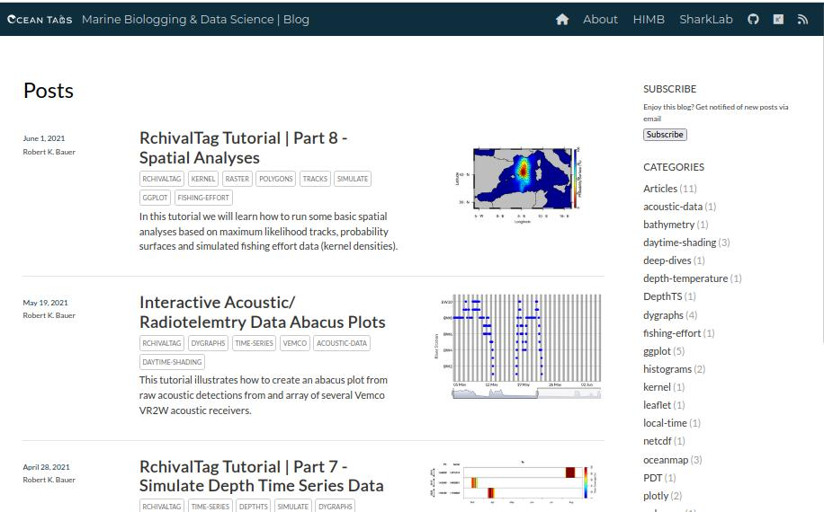

  

<h4 align="center">Marine Data Science Tutorials in R</h4>

  <a href="#author">Author</a> •
  <a href="#about">About</a> •
  <a href="#tutorials">Tutorials</a> •
  <a href="#packages">Related Packages</a> •
  <a href="#credits">Credits</a> •
  <a href="#license">License</a>

---

**Visit the full blog here:**
https://rkbauer.github.io/oceantags/

---

---

## Author

[Dr. Robert Bauer | Fishery Biologist & Data Scientist](https://scholar.google.com/citations?hl=en&user=J-0_tdbR2tgC)

---

## About

**oceantags** is a marine data science blog providing hands-on tutorials for analyzing, visualizing, and interpreting oceanographic and electronic tagging data in **R**.

The tutorials focus on:

- Archival & acoustic telemetry data  
- Oceanographic data integration  
- Spatial and temporal analyses  
- Interactive data visualization  
- Reproducible marine data workflows  

The content is tightly linked to the R packages:

- [`RchivalTag`](https://github.com/rkbauer/RchivalTag)  
- [`oceanmap`](https://github.com/rkbauer/R_Package_oceanmap)

---

## Tutorials

### Acoustic Telemetry

- **Interactive Raw Detections Abacus Plots**  
  → https://rkbauer.github.io/oceantags/acoustic_telemetry_Tutorial_Interactive_raw_detections_abacus_plots/

---

### oceanmap Tutorials

- **Part 1: Landmasks**  
  → https://rkbauer.github.io/oceantags/oceanmap_Tutorial_Part1_Landmasks/

- **Part 2: Oceanographic Data**  
  → https://rkbauer.github.io/oceantags/oceanmap_Tutorial_Part2_Oceanographic_Data/

---

### RchivalTag Tutorials

- **Part 1: Histograms**  
  → https://rkbauer.github.io/oceantags/RchivalTag_Tutorials_Part1_Histograms/

- **Part 2: Time Series Data**  
  → https://rkbauer.github.io/oceantags/RchivalTag_Tutorials_Part2_Time_Series_Data/

- **Part 3: PDT Data**  
  → https://rkbauer.github.io/oceantags/RchivalTag_Tutorials_Part3_PDT_Data/

- **Part 4: Geolocations**  
  → https://rkbauer.github.io/oceantags/RchivalTag_Tutorials_Part4_Geolocations/

- **Part 5: Visualizing Data in Local Time**  
  → https://rkbauer.github.io/oceantags/RchivalTag_Tutorials_Part5_Visualizing_Data_in_Local_Time/

- **Part 6: Quantifying Deep Dives**  
  → https://rkbauer.github.io/oceantags/RchivalTag_Tutorials_Part6_Quantify_Deep_Dives/

- **Part 7: Simulating Depth Time Series**  
  → https://rkbauer.github.io/oceantags/RchivalTag_Tutorials_Part7_Simulate_DepthTS/

- **Part 8: Spatial Analyses**  
  → https://rkbauer.github.io/oceantags/RchivalTag_Tutorials_Part8_Spatial_Analayses/

---

## Related Packages

- [`RchivalTag`](https://github.com/rkbauer/RchivalTag)  
  → Tools for analyzing archival tagging data  

- [`oceanmap`](https://github.com/rkbauer/R_Package_oceanmap)  
  → Visualization of oceanographic and spatial data  

---

## Credits

The tutorials and underlying tools were developed during:

- PhD at IFREMER  
- Postdoctoral research at IRD  
- Both part of the MARBEC laboratory  

The blog extends these developments with modern workflows and interactive visualizations in R.

---

## Visit my work on

> [GitHub](https://github.com/rkbauer/) &nbsp;&middot;&nbsp;  
> [Google Scholar](https://scholar.google.com/citations?hl=en&user=J-0_tdbR2tgC) &nbsp;&middot;&nbsp;  
> [ResearchGate](https://www.researchgate.net/profile/Robert-Bauer-13)

---

## License

GPL (>= 3)
